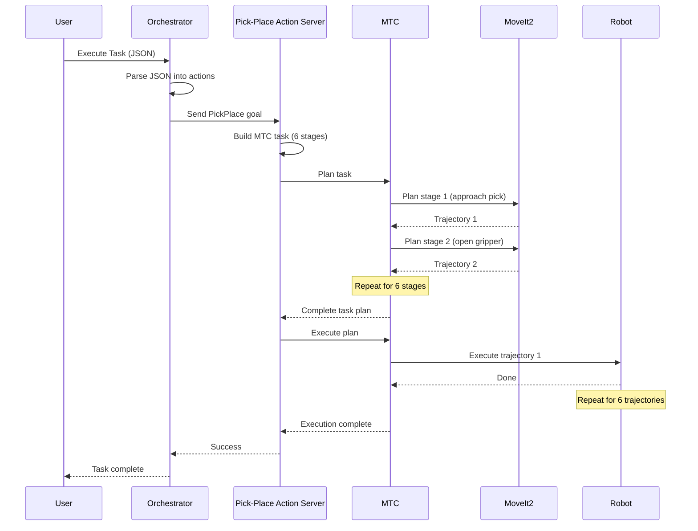

# DEVELOPER ONBOARDING DOCUMENTATION ASSESSMENT
## erobs: Extensible Robotic Beamline Scientist

**Assessment Date:** December 1, 2025
**Repository:** /home/aditya/work/github_ws/erobs
**Branch:** zivid_integration
**Purpose:** Enable external developers to clone, understand, build, and contribute to this project

---

## EXECUTIVE SUMMARY

**Overall Onboarding Readiness: 4/10** - Significant gaps exist that would prevent effective developer onboarding.

### Current State
- **Code Quality:** Working and functional ✅
- **Package-Level Docs:** Good for individual packages ✅
- **Architecture Overview:** Missing ❌
- **Build Instructions:** Incomplete ⚠️
- **Dependency Management:** Partially documented ⚠️
- **Contributing Guidelines:** Missing ❌
- **Troubleshooting:** Missing ❌

### Critical Gaps for Peer Review & Collaboration
1. No comprehensive build/setup instructions in root README
2. Missing CONTRIBUTING.md with development workflow
3. No architecture diagrams or system overview documentation
4. Incomplete dependency setup instructions
5. No troubleshooting guide for common issues
6. Missing code examples for common tasks
7. No development environment setup guide

---

## 1. README.md ASSESSMENT

**File:** `/home/aditya/work/github_ws/erobs/README.md`
**Current Length:** 74 lines
**Grade:** C (60/100)

### ✅ What Exists
- [x] Project title and one-line description
- [x] Quick start example (minimal)
- [x] System architecture (high-level bullet points)
- [x] Key packages listed with links
- [x] Basic testing commands
- [x] Dependencies (high-level only)

### ❌ Critical Gaps

#### Missing: Comprehensive Build/Setup Instructions
**Current state:**
```bash
# Build workspace
colcon build

# Launch system (replace with your robot IP)
source install/setup.bash
ros2 launch mtc_pipeline modular_action_servers.launch.py robot_ip:=192.168.1.10
```

**Problems:**
- Assumes workspace already has dependencies installed
- Doesn't mention required `.repos` files to import
- No rosdep setup instructions
- No mention of external dependencies (Zivid SDK, UR driver setup)
- Missing vcs tool installation
- No pre-build checks or validation

**What's needed:**
```markdown
## Setup Instructions

### Prerequisites
- Ubuntu 22.04 LTS
- ROS 2 Humble installed (`ros-humble-desktop`)
- Python 3.10+
- Git and vcstool
- Zivid SDK 2.13+ (for vision system)

### Installation

1. **Install system dependencies:**
   ```bash
   sudo apt update
   sudo apt install -y python3-vcstool python3-rosdep
   ```

2. **Create workspace and clone repository:**
   ```bash
   mkdir -p ~/erobs_ws/src
   cd ~/erobs_ws/src
   git clone https://github.com/YOUR_ORG/erobs.git
   cd erobs
   ```

3. **Import all dependencies using vcstool:**
   ```bash
   cd ~/erobs_ws
   vcs import src < src/erobs/src/ros2.repos
   vcs import src/end_effectors < src/erobs/src/end_effectors/end_effectors.repos
   vcs import src/vision < src/erobs/src/vision/vision.repos
   ```

4. **Install ROS dependencies:**
   ```bash
   cd ~/erobs_ws
   sudo rosdep init  # Skip if already initialized
   rosdep update
   rosdep install --from-paths src --ignore-src -y --skip-keys 'moveit_studio_behavior_interface zivid_description'
   ```

5. **Build workspace:**
   ```bash
   cd ~/erobs_ws
   colcon build --symlink-install
   source install/setup.bash
   ```

### Verification
Test the installation:
```bash
# Check core packages built successfully
ros2 pkg list | grep mtc_pipeline
ros2 pkg list | grep ur5e_moveit_configs

# Launch in simulation mode (no robot required)
ros2 launch ur_zivid_hande_moveit_config robot_bringup.launch.py use_fake_hardware:=true
```
```

#### Missing: Architecture Overview with Context

**Current state:** Brief bullet points
**Needed:** Full architecture section explaining:
- System boundaries (what's in scope, what's external)
- Component interaction diagram (at least ASCII art)
- Data flow between components
- Key design decisions and rationale

**Example addition:**
```markdown
## Architecture Overview

### System Diagram

```
┌─────────────────────────────────────────────────────────────────┐
│                         EROBS System                             │
├─────────────────────────────────────────────────────────────────┤
│                                                                  │
│  ┌──────────────┐         ┌─────────────────┐                  │
│  │  Bluesky/    │────────▶│ MTC Orchestrator│                  │
│  │  Ophyd       │         │  (Action Server) │                  │
│  │  (External)  │         └────────┬────────┘                  │
│  └──────────────┘                  │                            │
│                                    │                            │
│                         ┌──────────▼────────────┐              │
│                         │  Modular Action       │              │
│                         │  Servers (7):         │              │
│                         │  - move_to            │              │
│                         │  - pick_place         │              │
│                         │  - vision_move_to     │              │
│                         │  - end_effector       │              │
│                         │  - tool_exchange      │              │
│                         │  - pipettor           │              │
│                         │  - vision_pick_place  │              │
│                         └──────────┬────────────┘              │
│                                    │                            │
│                    ┌───────────────┴───────────────┐           │
│                    │                                │           │
│           ┌────────▼─────────┐          ┌─────────▼────────┐  │
│           │   MoveIt2 +      │          │  Vision System   │  │
│           │   MTC Core       │          │  (Zivid Camera)  │  │
│           └────────┬─────────┘          └─────────┬────────┘  │
│                    │                                │           │
│           ┌────────▼─────────┐          ┌─────────▼────────┐  │
│           │  UR Robot Driver │          │  Gripper Drivers │  │
│           │  (ros2_control)  │          │  (Hand-E/EPick)  │  │
│           └────────┬─────────┘          └─────────┬────────┘  │
│                    │                                │           │
│                    └──────────┬─────────────────────┘           │
│                               │                                  │
│                    ┌──────────▼──────────┐                      │
│                    │  UR5e Robot + Tool  │                      │
│                    │  Exchanger + Zivid  │                      │
│                    └─────────────────────┘                      │
└─────────────────────────────────────────────────────────────────┘
```

### Key Design Decisions

1. **Modular Action Server Pattern**: Each manipulation primitive (pick, place, move) is
   implemented as a separate ROS 2 action server. This allows independent development,
   testing, and composition of behaviors.

2. **MTC-Based Planning**: All motion planning uses MoveIt Task Constructor (MTC) for
   declarative, stage-based task specification with automatic failure recovery.

3. **Dynamic Gripper Switching**: System supports hot-swapping grippers by restarting
   MoveIt with different URDF/SRDF configurations. Trade-off: 15-second reconfiguration
   time vs. runtime flexibility.

4. **Vision-Integrated Planning**: ArUco marker detection integrated directly into motion
   planning stages, not as separate pre-processing step.
```

#### Missing: Usage Examples Beyond Quick Start

**Current state:** Only one minimal launch command
**Needed:** Multiple real-world scenarios:

```markdown
## Usage Examples

### Example 1: Basic Pick and Place (Simulation)

1. Launch simulated robot with Hand-E gripper:
   ```bash
   ros2 launch ur_zivid_hande_moveit_config robot_bringup.launch.py use_fake_hardware:=true
   ```

2. In another terminal, launch action servers:
   ```bash
   source install/setup.bash
   ros2 launch mtc_pipeline mtc_bringup.launch.py robot_ip:=192.168.1.10 enable_vision:=false
   ```

3. Send a pick-place task via GUI:
   ```bash
   ros2 launch mtc_gui mtc_gui_client.launch.py
   ```

### Example 2: Vision-Guided Manipulation

1. Connect Zivid camera and verify:
   ```bash
   ZividListCameras
   ```

2. Launch with vision enabled:
   ```bash
   ros2 launch ur_zivid_hande_moveit_config robot_bringup.launch.py robot_ip:=192.168.1.100
   ros2 launch mtc_pipeline mtc_bringup.launch.py robot_ip:=192.168.1.100 enable_vision:=true
   ```

3. Test marker detection:
   ```bash
   ros2 service call /capture_and_detect_markers zivid_interfaces/srv/CaptureAndDetectMarkers "{dictionary: 'aruco4x4_50'}"
   ```

### Example 3: Tool Exchange

See [Tool Exchange Guide](docs/TOOL_EXCHANGE_GUIDE.md) for complete procedure.
```

#### Missing: Contributing Guidelines

**Current state:**
```markdown
## Contributing

This is an active research project. Contact the maintainers before making significant changes.
```

**Problem:** Too vague, no actionable information.

**What's needed:** Create `CONTRIBUTING.md` with:
- Code style guidelines (C++ and Python)
- Branch naming conventions
- Commit message format
- Pull request process
- Code review expectations
- Testing requirements before PR
- How to report bugs
- Communication channels (Slack, issues, email)

#### Missing: Troubleshooting Section

**Needed:**
```markdown
## Troubleshooting

### Build Issues

**Problem:** `Could not find package 'zivid_interfaces'`
**Solution:** Zivid SDK not installed. Follow [Zivid installation guide](https://support.zivid.com/en/latest/getting-started/software-installation.html)

**Problem:** `CMake Error: moveit_task_constructor_core not found`
**Solution:** Import MTC from ros2.repos:
```bash
vcs import src < src/ros2.repos
```

### Runtime Issues

**Problem:** Robot won't connect, timeout errors
**Solution:**
1. Verify robot IP: `ping 192.168.1.10`
2. Check robot is in Remote Control mode
3. Verify External Control URCap program is running

**Problem:** MoveIt planning fails immediately
**Solution:**
1. Check joint limits in RViz
2. Verify collision geometry loaded: `ros2 topic echo /planning_scene`
3. Restart move_group with verbose logging: `ros2 launch ... log-level:=DEBUG`

### Vision Issues

**Problem:** No ArUco markers detected
**Solution:**
1. Verify camera connection: `ZividListCameras`
2. Check lighting conditions (avoid glare on markers)
3. Adjust Zivid settings in `config/zivid_settings.yml`
4. Verify marker dictionary matches: default is `aruco4x4_50`

See [FAQ](docs/FAQ.md) for more common issues.
```

---

## 2. PACKAGE DOCUMENTATION ASSESSMENT

### 2.1 mtc_pipeline Package

**File:** `/home/aditya/work/github_ws/erobs/src/mtc_pipeline/README.md`
**Length:** 243 lines
**Grade:** B+ (85/100)

#### ✅ Strengths
- Excellent coverage of action servers and their purposes
- Good package structure explanation
- Comprehensive action definitions listed
- Usage examples with code snippets
- Configuration notes (pose definitions, planner settings)
- Integration notes with MoveIt packages

#### ⚠️ Gaps
1. **Missing gripper configuration documentation:**
   - Where is the gripper config YAML file?
   - How to add a new gripper type?
   - What are the valid gripper identifiers?

   **Needed addition:**
   ```markdown
   ## Gripper Configuration

   Gripper types are configured in `config/grippers.yaml`:

   ```yaml
   grippers:
     hande:
       moveit_package: "ur_zivid_hande_moveit_config"
       tool_voltage: 24
     epick:
       moveit_package: "ur_zivid_epick_moveit_config"
       tool_voltage: 24
     pipettor:
       moveit_package: "ur_zivid_pipettor_moveit_config"
       tool_voltage: 12
   ```

   ### Adding a New Gripper

   1. Create MoveIt config package following the pattern in `ur5e_moveit_configs/`
   2. Add entry to `config/grippers.yaml`
   3. Define SRDF states for open/close in your MoveIt config
   4. Update gripper driver launch files if needed

   See [Gripper Integration Guide](docs/GRIPPER_INTEGRATION.md) for details.
   ```

2. **No launch file documentation:**
   - What does `mtc_bringup.launch.py` actually do?
   - What order do nodes start in?
   - What parameters can be overridden?

   **Add to README:**
   ```markdown
   ## Launch Files

   ### mtc_bringup.launch.py

   **Purpose:** Starts all MTC action servers and the orchestrator.

   **Required:** MoveIt2 move_group must already be running (launched separately via moveit_config package)

   **Nodes Launched:**
   1. Core action servers (always):
      - pick_place_action_server
      - tool_exchange_action_server
      - move_to_action_server
      - end_effector_action_server
      - pipettor_action_server
      - mtc_orchestrator_action_server

   2. Vision components (conditional, controlled by `enable_vision` parameter):
      - vision_action_server
      - vision_pick_place_action_server
      - zivid_camera node

   **Parameters:**
   - `robot_ip` (default: '192.168.56.101'): Robot IP address for orchestrator
   - `enable_vision` (default: 'true'): Enable/disable vision system

   **Example:**
   ```bash
   ros2 launch mtc_pipeline mtc_bringup.launch.py robot_ip:=192.168.1.100 enable_vision:=false
   ```

   **Launch Sequence:**
   ```
   1. Launch ur_zivid_hande_moveit_config (separate terminal)
   2. Wait for move_group to be ready (~10 seconds)
   3. Launch mtc_bringup.launch.py
   4. Action servers connect to move_group
   5. System ready for task execution
   ```
   ```

3. **No vision configuration documentation:**
   - Where is `vision_objects.json`?
   - What's the schema?
   - How to add new object types?

### 2.2 mtc_gui Package

**File:** `/home/aditya/work/github_ws/erobs/src/mtc_gui/README.md`
**Length:** 74 lines
**Grade:** C+ (70/100)

#### ✅ Strengths
- Clear component list
- Basic usage instructions
- Architecture explanation

#### ❌ Gaps
- No screenshots or UI guide
- No explanation of task JSON format
- Missing workflow tutorial

**Needed additions:**
```markdown
## GUI Workflow Tutorial

### Creating Your First Task

1. **Launch the GUI:**
   ```bash
   ros2 launch mtc_gui mtc_gui_client.launch.py
   ```

2. **Add a Movement Step:**
   - Click "Add Task" button
   - Select task type: "move_to"
   - Set target: "home"
   - Click "Add to Sequence"

3. **Add a Pick-Place Step:**
   - Click "Add Task"
   - Select task type: "pick_place"
   - Configure:
     - Gripper type: "hande"
     - Pick approach: "pick_approach"
     - Pick target: "pick_pos"
     - Place approach: "place_approach"
     - Place target: "place_pos"

4. **Define Poses:**
   - Click "Manage Poses" button
   - Add pose "home": [0, -90, 90, -90, -90, 0]
   - Add other required poses...

5. **Execute Task:**
   - Click "Execute Task" button
   - Monitor execution in status panel

### Task JSON Format

The GUI generates JSON like this:
```json
{
  "tasks": [
    {
      "type": "move_to",
      "target": "home",
      "planning_type": "joint"
    },
    {
      "type": "pick_place",
      "gripper": "hande",
      "pick_approach": "pick_approach",
      "pick_target": "pick_target",
      "place_approach": "place_approach",
      "place_target": "place_target"
    }
  ],
  "poses": {
    "home": [0, -90, 90, -90, -90, 0],
    "pick_approach": [30, -100, 95, -85, -90, 0],
    "pick_target": [30, -110, 100, -80, -90, 0],
    "place_approach": [-30, -100, 95, -85, -90, 0],
    "place_target": [-30, -110, 100, -80, -90, 0]
  }
}
```

### Saving and Loading Tasks

- **Save:** File → Save Task → Choose location
- **Load:** File → Load Task → Select JSON file
```

### 2.3 ur5e_robot_description Package

**File:** `/home/aditya/work/github_ws/erobs/src/ur5e_robot_description/README.md`
**Length:** 123 lines
**Grade:** A- (90/100)

#### ✅ Strengths
- Excellent documentation of robot configurations
- Clear dependency listing
- Frame convention documentation
- Hardware configuration notes
- Integration notes

#### Minor Gaps
- Could add visual diagram of robot chain
- Example xacro usage snippets

### 2.4 ur5e_moveit_configs Package

**File:** `/home/aditya/work/github_ws/erobs/src/ur5e_moveit_configs/README.md`
**Length:** 171 lines
**Grade:** A (92/100)

#### ✅ Strengths
- Comprehensive configuration documentation
- Excellent payload configuration table
- Named states clearly documented
- Launch parameter documentation
- Configuration consistency notes

#### Minor Enhancement Opportunity
- Add quick reference table mapping gripper → package → launch command

---

## 3. CODE DOCUMENTATION ASSESSMENT

### 3.1 Header File Documentation

**Files Examined:**
- `base_action_server.hpp`
- `base_stages.hpp`
- `gripper_config_registry.hpp`
- `pick_place_stages.hpp`

**Grade:** B (80/100)

#### ✅ Strengths - Good Examples Found

**gripper_config_registry.hpp** - Excellent Doxygen documentation:
```cpp
/**
 * @brief Registry for gripper configurations loaded from YAML
 *
 * Manages gripper-specific settings including MoveIt packages and tool voltages.
 * Configurations are loaded from a YAML file at initialization, allowing new
 * grippers to be added without code changes.
 *
 * Example usage:
 * @code
 * GripperConfigRegistry registry(node, "config/grippers.yaml");
 * auto config = registry.get_config("hande");
 * if (config) {
 *     launch_moveit(config->moveit_package);
 *     set_voltage(config->tool_voltage);
 * }
 * @endcode
 */
```

**base_action_server.hpp** - Good inline documentation:
```cpp
// Template base class for MTC action servers.
// Handles goal lifecycle, threading, and concurrent execution prevention.
//
// Usage:
//   class MyServer : public BaseActionServer<MyAction, MyStages> { ... };
//   auto node = std::make_shared<MyServer>();
//   node->initialize_stages();  // Required: shared_from_this() not available in ctor
//   rclcpp::spin(node);
```

#### ⚠️ Gaps and Inconsistencies

**pick_place_stages.hpp** - Minimal documentation:
```cpp
// Pick and place sequence: approach → grip → retreat → approach → release → retreat

#pragma once

#include "mtc_pipeline/base_stages.hpp"
#include "mtc_pipeline/action/pick_place_action.hpp"
#include <nlohmann/json.hpp>

class PickPlaceStages : public BaseStages {
public:
    PickPlaceStages(const rclcpp::Node::SharedPtr& node);
    bool run(const mtc_pipeline::action::PickPlaceAction::Goal& goal);
    // ... private methods with no documentation
```

**Recommended improvements:**
1. Add Doxygen comments to all public API classes and methods
2. Document all action message fields
3. Add parameter descriptions to all functions
4. Include usage examples in complex classes

**Example of needed improvement for pick_place_stages.hpp:**
```cpp
/**
 * @brief MTC stage implementation for pick-and-place manipulation sequences
 *
 * Generates a 6-stage MTC task:
 * 1. Approach pick pose (Cartesian move)
 * 2. Open gripper (joint space)
 * 3. Retreat from pick (Cartesian move)
 * 4. Approach place pose (Cartesian move)
 * 5. Close gripper (joint space)
 * 6. Retreat from place (Cartesian move)
 *
 * All Cartesian moves enforce wrist_3 = 0 constraint to keep objects level.
 *
 * @see PickPlaceAction.action for goal message definition
 * @see BaseStages for common planning utilities
 */
class PickPlaceStages : public BaseStages {
public:
    /**
     * @brief Construct pick-place stage manager
     * @param node ROS 2 node for communication and logging
     */
    PickPlaceStages(const rclcpp::Node::SharedPtr& node);

    /**
     * @brief Execute pick-place sequence
     *
     * @param goal Action goal containing pose names and gripper type
     * @return true if planning and execution succeed, false otherwise
     *
     * @note Blocks until execution completes or fails
     * @throws std::runtime_error if gripper type not recognized
     */
    bool run(const mtc_pipeline::action::PickPlaceAction::Goal& goal);

private:
    /**
     * @brief Create MTC stage for moving to named joint configuration
     *
     * @param label Stage name for debugging/visualization
     * @param pose_key Key to lookup in poses JSON object
     * @param poses JSON object mapping pose names to joint arrays
     * @param planner Planning algorithm (pipeline/cartesian/joint_interpolation)
     * @return Unique pointer to configured MTC stage
     */
    std::unique_ptr<mtc::Stage> make_move_to_named_stage(
        const std::string& label,
        const std::string& pose_key,
        const nlohmann::json& poses,
        const mtc::solvers::PlannerInterfacePtr& planner);
    // ... more documented methods
};
```

### 3.2 Action Definition Documentation

**Files:** `src/mtc_pipeline/action/*.action`

**Assessment:** Need to verify if action files have inline documentation.

**Recommended format:**
```
# Pick and place action - executes grasp-move-release sequence
#
# This action plans and executes a complete pick-place operation:
# 1. Move to pick approach pose
# 2. Open gripper
# 3. Move to pick grasp pose
# 4. Close gripper
# 5. Retreat from pick
# 6. Move to place approach pose
# 7. Open gripper
# 8. Retreat from place

# JSON string containing pose definitions
# Format: {"pose_name": [j1, j2, j3, j4, j5, j6], ...}
# Joint angles in degrees
string poses_json

# Name of pose to approach pick position (must exist in poses_json)
string pick_approach

# Name of pose at pick grasp position (must exist in poses_json)
string pick_target

# ... (rest of fields with descriptions)
```

---

## 4. DEVELOPER SETUP ASSESSMENT

### 4.1 Dependency Management

**Grade:** C (65/100)

#### ✅ What Works
- `.repos` files exist for modular dependency import
- `setup.sh` script provides automated setup (9 lines)
- rosdep skip keys documented in setup.sh

#### ❌ Problems

1. **setup.sh is hidden/not documented in README:**
   - File exists but README says `colcon build` directly
   - Developers won't discover this helpful script

2. **No validation of prerequisites:**
   - Doesn't check if ROS 2 is installed
   - Doesn't verify vcstool availability
   - No check for Zivid SDK before building vision packages

3. **Missing external dependency documentation:**
   - Zivid SDK installation not mentioned
   - UR robot driver prerequisites not listed
   - No guidance on udev rules for grippers

**Recommended improvements:**

**Create: `docs/DEPENDENCIES.md`**
```markdown
# Dependency Guide

## System Dependencies

### Required
- Ubuntu 22.04 LTS
- ROS 2 Humble Desktop Full
- Python 3.10+
- vcstool
- rosdep

### Optional (based on hardware)
- Zivid SDK 2.13+ (for Zivid camera support)
- libserial-dev (for serial grippers)

## External Package Dependencies

### ROS 2 Packages (via rosdep)
See `package.xml` files for complete list. Key dependencies:
- moveit_ros_planning_interface
- ros2_control
- controller_manager
- ur_robot_driver

### Vision System Dependencies
**For Zivid 3D camera:**
1. Install Zivid SDK:
   ```bash
   wget https://downloads.zivid.com/sdk/releases/2.13.0+de9c5dae-1/u22/zivid_2.13.0+de9c5dae-1_amd64.deb
   sudo dpkg -i zivid_2.13.0+de9c5dae-1_amd64.deb
   ```

2. Verify installation:
   ```bash
   ZividListCameras
   ```

**For ZED camera (optional):**
See [ZED SDK installation](https://www.stereolabs.com/docs/installation/linux/)

### Gripper Driver Dependencies

**For serial communication (Hand-E, EPick):**
```bash
sudo apt install libserial-dev
```

**udev rules for stable device naming:**

Create `/etc/udev/rules.d/99-ur-gripper.rules`:
```
# Robotiq Hand-E gripper
SUBSYSTEM=="tty", ATTRS{idVendor}=="0403", ATTRS{idProduct}=="6001", SYMLINK+="ttyUR", MODE="0666"
```

Reload udev:
```bash
sudo udevadm control --reload-rules
sudo udevadm trigger
```

## Dependency Installation Order

1. System packages (ROS 2, build tools)
2. External SDKs (Zivid, ZED if needed)
3. udev rules for hardware
4. ROS 2 package dependencies (rosdep)
5. Workspace packages (colcon build)
```

**Update setup.sh with validation:**
```bash
#!/bin/bash
set -e

# Colors for output
RED='\033[0;31m'
GREEN='\033[0;32m'
YELLOW='\033[1;33m'
NC='\033[0m' # No Color

echo "EROBS Dependency Setup"
echo "====================="

# Check ROS 2 installation
if [ -z "$ROS_DISTRO" ]; then
    echo -e "${RED}Error: ROS 2 not sourced. Please run:${NC}"
    echo "  source /opt/ros/humble/setup.bash"
    exit 1
fi

echo -e "${GREEN}✓ ROS 2 $ROS_DISTRO detected${NC}"

# Check vcstool
if ! command -v vcs &> /dev/null; then
    echo -e "${YELLOW}Installing vcstool...${NC}"
    sudo apt install -y python3-vcstool
fi

echo -e "${GREEN}✓ vcstool available${NC}"

# Import dependencies
echo "Importing ROS package dependencies..."
vcs import < src/ros2.repos src
vcs import < src/end_effectors/end_effectors.repos src/end_effectors
vcs import < src/vision/vision.repos src/vision

# Check optional dependencies
echo ""
echo "Checking optional dependencies:"
if command -v ZividListCameras &> /dev/null; then
    echo -e "${GREEN}✓ Zivid SDK installed${NC}"
else
    echo -e "${YELLOW}⚠ Zivid SDK not found (required for 3D vision)${NC}"
    echo "  Install from: https://support.zivid.com/en/latest/getting-started/software-installation.html"
fi

# Install ROS dependencies
echo ""
echo "Installing ROS package dependencies..."
sudo apt-get update
rosdep update
rosdep install --from-paths src --ignore-src -y --skip-keys 'moveit_studio_behavior_interface zivid_description'

echo ""
echo -e "${GREEN}✓ Dependencies setup complete!${NC}"
echo ""
echo "Next steps:"
echo "  1. Review docs/DEPENDENCIES.md for hardware-specific setup"
echo "  2. Build workspace: colcon build --symlink-install"
echo "  3. Source workspace: source install/setup.bash"
```

### 4.2 Build Instructions

**Grade:** D (55/100)

**Problems:**
1. No mention of build flags or options
2. No guidance on selective package building
3. Missing build time estimates
4. No troubleshooting for common build errors

**Needed in README or BUILD.md:**
```markdown
## Building the Workspace

### Full Build (First Time)

Expected time: 15-20 minutes on 8-core machine

```bash
cd ~/erobs_ws
colcon build --symlink-install --cmake-args -DCMAKE_BUILD_TYPE=Release
source install/setup.bash
```

**Build flags explained:**
- `--symlink-install`: Symlink Python scripts (faster development iteration)
- `--cmake-args -DCMAKE_BUILD_TYPE=Release`: Optimized binaries (use `Debug` for development)

### Selective Building

**Build only core packages (faster iteration):**
```bash
colcon build --packages-select mtc_pipeline mtc_gui --symlink-install
```

**Build a package and its dependencies:**
```bash
colcon build --packages-up-to mtc_pipeline --symlink-install
```

**Skip vision packages (if no Zivid SDK):**
```bash
colcon build --packages-skip zivid_camera zivid_interfaces --symlink-install
```

### Parallel Builds

Speed up builds using multiple cores:
```bash
colcon build --symlink-install --parallel-workers 8
```

### Build Troubleshooting

**Error: `Could not find package 'moveit_task_constructor_core'`**
```bash
# Import MTC from repos file
vcs import src < src/ros2.repos
# Rebuild
colcon build --packages-select moveit_task_constructor_core
```

**Error: `Could not find zivid SDK`**
```bash
# Either install Zivid SDK or skip vision packages
colcon build --packages-skip zivid_camera zivid_interfaces --symlink-install
```

**Error: Build fails with "killed" or runs out of memory**
```bash
# Reduce parallel jobs
colcon build --parallel-workers 2 --symlink-install
```

### Verifying the Build

```bash
# Check all packages built successfully
colcon list --packages-select mtc_pipeline mtc_gui ur5e_moveit_configs

# Test core package imports
source install/setup.bash
ros2 pkg list | grep mtc
ros2 pkg list | grep ur5e
```
```

### 4.3 Testing Documentation

**Grade:** F (20/100)

**Current state in README:**
```markdown
## Testing

```bash
# Build and run tests
colcon build
colcon test --packages-select mtc_pipeline
colcon test-result --verbose
```
```

**Problems:**
1. No explanation of what tests exist
2. No mention that tests don't exist yet (based on no test files found)
3. No guidance on how to write tests
4. Missing testing strategy

**Needed: Create `docs/TESTING.md`**
```markdown
# Testing Guide

## Current Test Status

**Coverage:** Minimal - Tests are under development

**Existing Tests:**
- None currently implemented for mtc_pipeline
- Integration testing done manually via GUI and example scripts

## Manual Testing

### System Integration Test

1. **Launch robot in simulation:**
   ```bash
   ros2 launch ur_zivid_hande_moveit_config robot_bringup.launch.py use_fake_hardware:=true
   ```

2. **Launch action servers:**
   ```bash
   ros2 launch mtc_pipeline mtc_bringup.launch.py enable_vision:=false
   ```

3. **Test basic movement:**
   ```bash
   # Send move_to action (requires action client or GUI)
   ros2 launch mtc_gui mtc_gui_client.launch.py
   # In GUI: Add "move_to" task, target="home", execute
   ```

4. **Verify success:**
   - Robot moves to home position in RViz
   - No error messages in action server terminal
   - Action returns success status

### Action Server Testing

Test each action server individually:

**move_to_action_server:**
```bash
# Test via command line (requires ros2 action CLI)
ros2 action send_goal /move_to_action mtc_pipeline/action/MoveToAction "{target: 'home', planning_type: 'joint', poses_json: '{\"home\": [0, -90, 90, -90, -90, 0]}'}"
```

**pick_place_action_server:**
See example in `task_sequences/` directory.

## Future: Automated Testing (Planned)

### Unit Tests (To Be Implemented)
- [ ] Gripper configuration registry tests
- [ ] JSON pose parsing tests
- [ ] Planner factory tests
- [ ] Relative movement calculation tests

### Integration Tests (To Be Implemented)
- [ ] Action server lifecycle tests
- [ ] MTC task generation tests
- [ ] Vision integration tests
- [ ] Tool exchange sequence tests

### Simulation Tests (To Be Implemented)
- [ ] Full pick-place cycle in Gazebo
- [ ] Multi-step orchestrated tasks
- [ ] Collision avoidance verification

## Writing Tests

When implementing tests, use `ament_cmake_gtest` for C++:

```cmake
if(BUILD_TESTING)
  find_package(ament_cmake_gtest REQUIRED)

  ament_add_gtest(test_gripper_registry test/test_gripper_registry.cpp)
  target_link_libraries(test_gripper_registry ${PROJECT_NAME}_lib)
endif()
```

For Python action servers, use `pytest`:
```python
import pytest
from mtc_pipeline.mtc_ophyd_device import MTCOphyd

def test_mtc_ophyd_initialization():
    device = MTCOphyd("test_device")
    assert device.name == "test_device"
```

Run Python tests:
```bash
pytest src/bluesky_ros/
```
```

---

## 5. ARCHITECTURE DOCUMENTATION ASSESSMENT

**Grade:** F (15/100)

### Critical Missing Documentation

#### 5.1 No System Architecture Document

**What exists:** Bullet points in README
**What's needed:** Dedicated `docs/ARCHITECTURE.md`

**Recommended content:**

```markdown
# EROBS System Architecture

## Executive Overview

EROBS is a modular robotic manipulation system designed for beamline sample handling
at NSLS-II. The architecture prioritizes flexibility (hot-swappable grippers),
reliability (MTC-based planning with failure recovery), and integration with scientific
workflows (Bluesky data acquisition).

## Design Principles

1. **Modularity:** Each manipulation primitive is an independent action server
2. **Declarative Planning:** MoveIt Task Constructor for composable motion sequences
3. **Hardware Abstraction:** ros2_control for unified robot/gripper interface
4. **Vision Integration:** 3D camera integrated directly into planning pipeline
5. **Scientific Integration:** Ophyd device interface for Bluesky experiments

## System Components

### Layer 1: Hardware Abstraction
- **UR Robot Driver:** ros2_control hardware interface for UR5e
- **Gripper Drivers:** Serial communication with Hand-E, EPick, Pipettor
- **Zivid Driver:** ROS 2 wrapper for Zivid 3D camera

### Layer 2: Motion Planning
- **MoveIt2:** Collision-aware motion planning
- **MoveIt Task Constructor (MTC):** Stage-based task composition
- **Planning Scene:** Beamline-specific collision environment

### Layer 3: Task Primitives (Action Servers)
- **move_to:** Joint/Cartesian motion to poses
- **pick_place:** Grasp-move-release sequences
- **vision_move_to:** ArUco marker-based positioning
- **end_effector:** Gripper open/close
- **tool_exchange:** Automated gripper swapping
- **pipettor:** Liquid handling operations
- **vision_pick_place:** Vision-guided pick-place

### Layer 4: Task Orchestration
- **MTC Orchestrator:** Multi-step task coordination
- **Gripper Lifecycle Manager:** MoveIt reconfiguration for tool changes
- **Bluesky Ophyd Interface:** Scientific workflow integration

### Layer 5: User Interfaces
- **mtc_gui:** Graphical task builder
- **Bluesky Plans:** Python-based experimental procedures
- **ROS 2 Actions:** Programmatic control via ROS 2 API

## Data Flow

### Pick-Place Task Example

```
User (GUI/Bluesky)
    │
    ├─ Sends JSON task to Orchestrator
    │
    ▼
Orchestrator
    │
    ├─ Parses task into sequence of actions
    │
    ▼
Action Servers (move_to, pick_place, etc.)
    │
    ├─ Build MTC task (stage composition)
    │
    ▼
MoveIt Task Constructor
    │
    ├─ Plan each stage (collision-free paths)
    │
    ▼
MoveIt2 Planning Scene
    │
    ├─ Validate against beamline geometry
    │
    ▼
ros2_control
    │
    ├─ Send trajectories to hardware
    │
    ▼
UR Robot + Gripper
    │
    └─ Execute physical motion
```

## Key Design Decisions

### 1. Why Modular Action Servers?

**Decision:** Separate action server per primitive (pick, place, move) rather than
monolithic planner.

**Rationale:**
- Independent development and testing
- Easier debugging (isolate failures to specific primitives)
- Flexible composition (reuse primitives in different task sequences)
- Parallel development (multiple developers can work on different primitives)

**Trade-off:** More ROS 2 nodes (higher memory) vs. modularity benefits

### 2. Why Restart MoveIt for Gripper Changes?

**Decision:** Orchestrator kills and relaunches move_group when grippers change.

**Rationale:**
- URDF/SRDF changes require full MoveIt reload (no hot-swap in ROS 2)
- Ensures collision geometry matches physical hardware
- Simpler than maintaining multiple simultaneous MoveIt instances

**Trade-off:** 15-second reconfiguration delay vs. runtime correctness

### 3. Why MoveIt Task Constructor vs. Custom Planning?

**Decision:** Use MTC for all motion planning rather than direct MoveIt calls.

**Rationale:**
- Declarative task specification (what not how)
- Automatic failure recovery and replanning
- Built-in Cartesian constraint handling
- Visualization and debugging tools

**Trade-off:** Learning curve vs. long-term maintainability

### 4. Why Zivid Built-in ArUco vs. Separate ROS Package?

**Decision:** Use Zivid SDK's ArUco detection rather than apriltag_ros package.

**Rationale:**
- 3D marker localization (full 6-DOF pose)
- Integrated 2D+3D capture (single service call)
- One less ROS 2 dependency

**Trade-off:** Vendor lock-in vs. integration simplicity

## Configuration Architecture

### Gripper Configuration Registry

Instead of hardcoded gripper→package mappings, EROBS uses YAML configuration:

```yaml
grippers:
  hande:
    moveit_package: "ur_zivid_hande_moveit_config"
    tool_voltage: 24
  epick:
    moveit_package: "ur_zivid_epick_moveit_config"
    tool_voltage: 24
```

**Benefits:**
- Add new grippers without code changes
- Site-specific configuration in config files
- Validation at startup (fail fast)

## Scaling Considerations

### Multi-Robot Support (Future)

Current architecture assumes single robot. For multi-robot:
- Namespace all topics/services by robot ID
- Separate MoveIt instances per robot
- Shared orchestrator with robot selection logic

### Performance Bottlenecks

1. **MoveIt Planning:** ~1-5 seconds per trajectory (depends on scene complexity)
2. **Vision Capture:** ~2-3 seconds for 3D point cloud
3. **Gripper Reconfiguration:** ~15 seconds (MoveIt restart)

## Security Architecture

See [COMPREHENSIVE_REVIEW_EXECUTIVE_SUMMARY.md](../COMPREHENSIVE_REVIEW_EXECUTIVE_SUMMARY.md)
for security analysis and recent vulnerability fixes.

## Testing Architecture

See [TESTING_IMPLEMENTATION_GUIDE.md](../TESTING_IMPLEMENTATION_GUIDE.md) for testing strategy.
```

#### 5.2 No Component Interaction Diagrams

**Needed:** Sequence diagrams for key workflows

**Example: Create `docs/diagrams/pick_place_sequence.md`**

```markdown
# Pick-Place Sequence Diagram


```

#### 5.3 Missing Integration Guide

**Needed:** `docs/BLUESKY_INTEGRATION.md` explaining:
- How EROBS integrates with Bluesky
- Ophyd device architecture
- Example Bluesky plans using EROBS
- Data flow between Bluesky and ROS 2

---

## 6. CRITICAL MISSING FILES

### 6.1 CONTRIBUTING.md (Critical)

**Status:** Does not exist
**Priority:** High
**Impact:** Blocks external contributions

**Required sections:**
1. Code of Conduct
2. How to report bugs
3. How to suggest features
4. Development workflow
   - Fork vs. branch workflow
   - Branch naming conventions (e.g., `feature/`, `bugfix/`, `docs/`)
   - Commit message format
5. Code style guidelines
   - C++: Follow ROS 2 style guide, use clang-format
   - Python: PEP 8, use black/isort
6. Testing requirements
   - All new features must include tests (when test framework ready)
   - Manual testing procedure for now
7. Pull request process
   - PR template
   - Required reviews (1 maintainer approval)
   - CI checks (when enabled)
8. Documentation requirements
   - Update relevant README files
   - Add Doxygen comments for public APIs
   - Update CHANGELOG

**Example template:**

```markdown
# Contributing to EROBS

Thank you for your interest in contributing! This document provides guidelines
for contributing to the EROBS project.

## Code of Conduct

Be respectful, constructive, and collaborative. We follow the [ROS Code of Conduct](https://www.ros.org/reps/rep-2003.html).

## Reporting Bugs

**Before submitting:**
1. Check existing issues to avoid duplicates
2. Verify the bug exists on the latest `main` branch
3. Gather system information (ROS version, Ubuntu version, hardware)

**Submit via GitHub Issues:**
- Use "Bug Report" template
- Include minimal reproduction steps
- Attach relevant logs (use pastebin for long logs)

## Suggesting Features

Open a GitHub issue with:
- Clear use case description
- Proposed API or interface
- Alternative approaches considered

Maintainers will label as `enhancement` and discuss feasibility.

## Development Workflow

### Setup Development Environment

1. Fork the repository on GitHub
2. Clone your fork:
   ```bash
   git clone https://github.com/YOUR_USERNAME/erobs.git
   cd erobs
   ```
3. Add upstream remote:
   ```bash
   git remote add upstream https://github.com/ORIGINAL_ORG/erobs.git
   ```
4. Follow setup instructions in README.md

### Creating a Branch

Use descriptive branch names with category prefix:
- `feature/add-realsense-support`
- `bugfix/fix-vision-timeout`
- `docs/update-gripper-guide`
- `refactor/modularize-planner`

```bash
git checkout -b feature/your-feature-name
```

### Making Changes

1. **Write clear commit messages:**
   ```
   Short summary (50 chars or less)

   More detailed explanation if needed. Wrap at 72 characters.
   Explain *why* the change was made, not just *what* changed.

   Fixes #123
   ```

2. **Follow code style:**
   - **C++:** ROS 2 style guide, use provided `.clang-format`
   - **Python:** PEP 8, format with `black src/` and `isort src/`

3. **Update documentation:**
   - Add/update Doxygen comments for C++ APIs
   - Update relevant README files
   - Add usage examples if introducing new features

4. **Test your changes:**
   - Build workspace: `colcon build --packages-select YOUR_PACKAGE`
   - Manual testing procedure (until automated tests available)
   - Verify no regressions in existing functionality

### Submitting a Pull Request

1. **Push to your fork:**
   ```bash
   git push origin feature/your-feature-name
   ```

2. **Open PR on GitHub:**
   - Use PR template (auto-populated)
   - Link related issues (Fixes #123)
   - Describe changes and rationale
   - Add screenshots/videos for UI changes

3. **Review process:**
   - Maintainer will review within 1 week
   - Address review comments with new commits (don't force-push during review)
   - Once approved, maintainer will merge

4. **After merge:**
   - Delete your branch
   - Pull latest main:
     ```bash
     git checkout main
     git pull upstream main
     ```

## Code Style Guidelines

### C++ Style

Follow [ROS 2 Developer Guide](https://docs.ros.org/en/humble/The-ROS2-Project/Contributing/Developer-Guide.html):
- Use `snake_case` for functions, variables
- Use `PascalCase` for class names
- Format code with clang-format: `clang-format -i src/**/*.cpp`

### Python Style

- Follow PEP 8
- Format with black: `black src/`
- Sort imports with isort: `isort src/`
- Maximum line length: 100 characters

### Documentation Style

- Use Doxygen for C++ header files
- Use Google-style docstrings for Python
- Include usage examples in complex APIs

## Testing Requirements

**Current status:** Test framework under development

**For now:**
- Manually test all changes before submitting PR
- Document test procedure in PR description
- Include before/after videos for behavior changes

**Future:**
- All new features must include unit tests
- Integration tests for new action servers
- Maintain >80% code coverage

## Questions?

- GitHub Discussions: General questions and design discussions
- GitHub Issues: Bug reports and feature requests
- Maintainer email: [maintainer@example.com]
```

### 6.2 CHANGELOG.md (Recommended)

**Status:** Does not exist
**Priority:** Medium
**Purpose:** Track version history and breaking changes

**Format:**
```markdown
# Changelog

All notable changes to this project will be documented in this file.

The format is based on [Keep a Changelog](https://keepachangelog.com/en/1.0.0/),
and this project adheres to [Semantic Versioning](https://semver.org/spec/v2.0.0.html).

## [Unreleased]

### Added
- Vision-guided pick-place action server
- Pipettor integration for liquid handling
- Dynamic gripper configuration via YAML

### Changed
- Replaced fork/exec with Launch API for gripper switching (security fix)
- Improved MoveIt lifecycle management

### Fixed
- Command injection vulnerability in orchestrator (CVE-XXXX-XXXX)
- Zombie process leak in gripper reconfiguration

## [0.1.0] - 2025-11-15

### Added
- Initial modular action server architecture
- MTC-based pick-place planning
- Zivid camera integration
- Hand-E and EPick gripper support
```

### 6.3 docs/FAQ.md (Recommended)

**Status:** Does not exist
**Priority:** Medium
**Purpose:** Common questions and troubleshooting

**Suggested content:**

```markdown
# Frequently Asked Questions

## General

### Q: What ROS 2 distribution is supported?
**A:** ROS 2 Humble on Ubuntu 22.04 LTS. Other distributions are not tested.

### Q: Can I use this with a different robot arm?
**A:** Theoretically yes, but would require:
1. New robot description package
2. New MoveIt config packages
3. Testing all action servers with new kinematics
4. Adjusting planner parameters

Currently only UR5e is supported.

### Q: Do I need the Zivid camera to use EROBS?
**A:** No. Launch with `enable_vision:=false` to disable vision components.
You can still use pre-programmed poses for pick-place operations.

## Installation

### Q: Build fails with "Could not find package 'moveit_task_constructor_core'"
**A:** Run the setup script to import all dependencies:
```bash
bash setup.sh
```
Or manually:
```bash
vcs import src < src/ros2.repos
```

### Q: I get "Zivid SDK not found" during build
**A:** Either:
1. Install Zivid SDK: https://support.zivid.com/en/latest/getting-started/software-installation.html
2. Skip vision packages: `colcon build --packages-skip zivid_camera zivid_interfaces`

### Q: rosdep fails for 'zivid_description'
**A:** This is expected. Use the `--skip-keys` flag as shown in setup.sh:
```bash
rosdep install --from-paths src --ignore-src -y --skip-keys 'moveit_studio_behavior_interface zivid_description'
```

## Usage

### Q: How do I know if the robot is connected?
**A:** Check the robot driver output. You should see:
```
[ur_control_node]: Robot connected to reverse interface. Ready to receive control commands.
```

### Q: MoveIt planning fails every time
**A:** Check:
1. Robot in valid configuration (check RViz)
2. Target pose is reachable (check joint limits)
3. No collisions with planning scene (adjust collision geometry)
4. Try increasing planning time in BaseStages

### Q: Vision system doesn't detect markers
**A:** Verify:
1. Camera connected: `ZividListCameras`
2. Markers are visible in camera view
3. Marker dictionary matches (default: `aruco4x4_50`)
4. Adequate lighting (avoid glare on markers)
5. Markers are in focus and not too small

### Q: Gripper doesn't respond
**A:** Check:
1. Gripper connected to robot tool flange USB port
2. udev rules configured (see docs/DEPENDENCIES.md)
3. Device appears: `ls -l /dev/ttyUR` or `/tmp/ttyUR`
4. Correct gripper driver launched
5. Tool voltage set correctly (24V for Hand-E/EPick, 12V for pipettor)

## Development

### Q: How do I add a new gripper?
**A:** See docs/GRIPPER_INTEGRATION.md for complete guide. Summary:
1. Create robot description URDF with new gripper
2. Create MoveIt config package
3. Add entry to config/grippers.yaml
4. Test with existing action servers

### Q: Can I use the action servers without the orchestrator?
**A:** Yes! Each action server is independent. Send goals directly via ROS 2 action API:
```bash
ros2 action send_goal /move_to_action mtc_pipeline/action/MoveToAction "{...}"
```

### Q: How do I debug MoveIt planning failures?
**A:** Enable verbose logging:
```bash
ros2 launch ur_zivid_hande_moveit_config robot_bringup.launch.py log-level:=DEBUG
```
Check RViz for planning scene visualization and failed trajectory markers.
```

### 6.4 docs/TROUBLESHOOTING.md (Critical)

**Status:** Does not exist
**Priority:** High
**Purpose:** Systematic troubleshooting guide

**Content:** (Already outlined in README section above)

### 6.5 docs/QUICKSTART.md (Recommended)

**Status:** Does not exist
**Priority:** Medium
**Purpose:** 10-minute guide to first successful run

**Example:**

```markdown
# Quick Start Guide

Get EROBS running in 10 minutes (simulation mode, no hardware required).

## Prerequisites

- Ubuntu 22.04 with ROS 2 Humble installed
- 20 GB free disk space
- Internet connection

## Step 1: Setup Workspace (5 minutes)

```bash
# Create workspace
mkdir -p ~/erobs_ws/src && cd ~/erobs_ws/src

# Clone repository
git clone https://github.com/YOUR_ORG/erobs.git
cd erobs

# Install dependencies (this may take a few minutes)
bash setup.sh

# Return to workspace root
cd ~/erobs_ws
```

## Step 2: Build (5 minutes)

```bash
# Build all packages
colcon build --symlink-install

# Source workspace
source install/setup.bash
```

## Step 3: Launch (30 seconds)

```bash
# Terminal 1: Launch simulated robot
ros2 launch ur_zivid_hande_moveit_config robot_bringup.launch.py use_fake_hardware:=true

# Terminal 2: Launch action servers (wait for Terminal 1 to finish loading)
source install/setup.bash
ros2 launch mtc_pipeline mtc_bringup.launch.py enable_vision:=false

# Terminal 3: Launch GUI
source install/setup.bash
ros2 launch mtc_gui mtc_gui_client.launch.py
```

## Step 4: Execute Your First Task

In the GUI:

1. Click "Add Task"
2. Select task type: "move_to"
3. Set target: "home"
4. Click "Add to Sequence"
5. Click "Manage Poses" and add pose:
   - Name: home
   - Values: [0, -90, 90, -90, -90, 0]
6. Click "Execute Task"

You should see the robot move to home position in RViz!

## Next Steps

- [Full Documentation](../README.md)
- [Architecture Overview](ARCHITECTURE.md)
- [Adding Grippers](GRIPPER_INTEGRATION.md)
```

---

## 7. PRIORITY ACTION ITEMS

### High Priority (Blocking External Collaboration)

1. **Expand README.md (3-4 hours)**
   - Add comprehensive build/setup section with prerequisites
   - Add troubleshooting section
   - Add usage examples beyond basic launch
   - Create proper dependency documentation

2. **Create CONTRIBUTING.md (2 hours)**
   - Development workflow
   - Code style guidelines
   - PR process
   - Testing requirements

3. **Create docs/ARCHITECTURE.md (4-5 hours)**
   - System overview diagram
   - Component descriptions
   - Key design decisions documented
   - Data flow diagrams

4. **Create docs/DEPENDENCIES.md (2 hours)**
   - Complete external dependency list
   - Installation instructions for Zivid SDK
   - udev rules documentation
   - Validation checklist

5. **Create docs/TROUBLESHOOTING.md (3 hours)**
   - Common build errors
   - Runtime issues
   - Vision system problems
   - Gripper connectivity issues

### Medium Priority (Improve Developer Experience)

6. **Enhance mtc_pipeline README (2 hours)**
   - Document gripper configuration YAML
   - Add launch file documentation
   - Document vision_objects.json schema
   - Add more usage examples

7. **Create docs/QUICKSTART.md (1 hour)**
   - 10-minute simulation tutorial
   - First task walkthrough

8. **Improve header documentation (3-4 hours)**
   - Add Doxygen comments to all public classes
   - Document all action message fields
   - Add usage examples in complex classes

9. **Create docs/FAQ.md (2 hours)**
   - Installation questions
   - Usage questions
   - Development questions

10. **Enhance mtc_gui README (2 hours)**
    - Add workflow tutorial
    - Document task JSON schema
    - Add screenshots (when possible)

### Low Priority (Nice to Have)

11. **Create CHANGELOG.md (1 hour)**
    - Document version history
    - Track breaking changes

12. **Create architecture diagrams (3-4 hours)**
    - Sequence diagrams for key workflows
    - Component interaction diagrams
    - Use draw.io or mermaid

13. **Create docs/BLUESKY_INTEGRATION.md (2-3 hours)**
    - Explain Ophyd device architecture
    - Example Bluesky plans
    - Data flow documentation

14. **Document gripper integration process (2 hours)**
    - Create docs/GRIPPER_INTEGRATION.md
    - Step-by-step guide for adding new grippers

---

## 8. ESTIMATED EFFORT

### To Reach "Good Enough for Peer Review" (60%)
**Total Time:** ~20-25 hours

**Required deliverables:**
1. Expanded README.md with comprehensive setup
2. CONTRIBUTING.md
3. docs/ARCHITECTURE.md
4. docs/DEPENDENCIES.md
5. docs/TROUBLESHOOTING.md
6. Enhanced mtc_pipeline README

### To Reach "Excellent for Open Source" (85%)
**Total Time:** ~35-40 hours (includes above + medium priority)

**Additional deliverables:**
7. docs/QUICKSTART.md
8. Improved header documentation
9. docs/FAQ.md
10. Enhanced mtc_gui README
11. CHANGELOG.md

### To Reach "Best in Class" (95%)
**Total Time:** ~45-50 hours (includes all above + diagrams)

**Additional deliverables:**
12. Architecture sequence diagrams
13. docs/BLUESKY_INTEGRATION.md
14. docs/GRIPPER_INTEGRATION.md
15. Video tutorials (not estimated here)

---

## 9. RECOMMENDATIONS

### Immediate Actions (This Week)

1. **Update README.md** with comprehensive setup instructions
   - Copy template from section 1 of this assessment
   - Validate instructions on fresh Ubuntu install
   - Add troubleshooting section

2. **Create CONTRIBUTING.md** to enable external contributions
   - Use template from section 6.1
   - Adjust workflow to match your team's preferences

3. **Create docs/ directory structure:**
   ```
   docs/
   ├── ARCHITECTURE.md
   ├── DEPENDENCIES.md
   ├── TROUBLESHOOTING.md
   ├── QUICKSTART.md
   ├── FAQ.md
   ├── GRIPPER_INTEGRATION.md
   ├── BLUESKY_INTEGRATION.md
   └── diagrams/
       ├── system_overview.png
       ├── pick_place_sequence.md
       └── tool_exchange_flow.md
   ```

### Short Term (Next 2 Weeks)

4. **Enhance package READMEs:**
   - mtc_pipeline: Add gripper config, launch file docs
   - mtc_gui: Add workflow tutorial
   - Ensure all packages have basic usage examples

5. **Improve code documentation:**
   - Add Doxygen comments to all public APIs
   - Document action message fields
   - Add usage examples in complex classes

### Medium Term (Next Month)

6. **Create architecture documentation:**
   - Write docs/ARCHITECTURE.md
   - Create sequence diagrams for key workflows
   - Document design decisions

7. **Build comprehensive troubleshooting guide:**
   - Collect common issues from development
   - Document solutions
   - Create FAQ

8. **Setup automated documentation:**
   - Enable GitHub Pages
   - Generate Doxygen documentation
   - Auto-publish on merge to main

---

## 10. CONCLUSION

**Current State:** The erobs codebase is functionally working with good package-level
documentation, but lacks the comprehensive setup, architecture, and contributing
documentation needed for external developers to effectively onboard.

**Key Gaps:**
1. No comprehensive build/setup guide (assumes expert ROS 2 knowledge)
2. Missing CONTRIBUTING.md (blocks external contributions)
3. No architecture overview (developers can't understand system design)
4. Insufficient troubleshooting documentation (developers get stuck)

**Impact:** A new developer cloning this repository would struggle to:
- Install all dependencies correctly (Zivid SDK, udev rules not documented)
- Understand system architecture (no overview or diagrams)
- Know how to contribute (no guidelines)
- Debug common issues (no troubleshooting guide)

**Recommendation:** Invest ~25 hours in high-priority documentation items to reach
"good enough for peer review" quality. This will enable effective collaboration
and reduce onboarding friction from days to hours.

**Success Metrics:**
- New developer can build system in <1 hour (with doc guidance)
- New developer understands architecture in <30 minutes (reading docs)
- External contributor knows exactly how to submit PR (CONTRIBUTING.md)
- Common issues have documented solutions (TROUBLESHOOTING.md)

---

## APPENDIX: Documentation Templates

See sections above for templates:
- README.md enhancements (Section 1)
- CONTRIBUTING.md template (Section 6.1)
- CHANGELOG.md template (Section 6.2)
- FAQ.md template (Section 6.3)
- QUICKSTART.md template (Section 6.5)
- ARCHITECTURE.md template (Section 5.1)
- DEPENDENCIES.md template (Section 4.1)

All templates are ready to copy and customize for erobs project.
