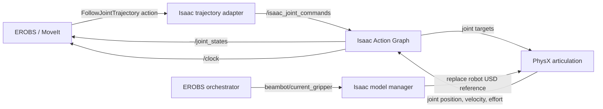

# Isaac Sim Integration Architecture

This document explains how Isaac Sim is connected to the EROBS planning and
execution stack. For installation and launch commands, see
[`isaac_sim_integration.md`](isaac_sim_integration.md).

## System Boundary

The integration keeps planning in EROBS and uses Isaac Sim as the robot
hardware layer:



MoveIt still performs collision checking, task planning, and trajectory
generation. Isaac Sim executes the resulting joint commands and publishes the
simulated robot state. The normal EROBS task and GUI interfaces therefore do
not need an Isaac-specific API.

## Components

| Component | Responsibility |
|---|---|
| `scripts/isaac_sim/start_erobs_sim.py` | Starts the stage, imports robot models, creates the Action Graph, manages physics, and swaps tool models |
| `beambot/isaac_trajectory_adapter.py` | Implements the controller action interfaces expected by MoveIt and converts trajectories into Isaac joint commands |
| `beambot_bringup.launch.py` | Exposes `use_isaac_sim` to the top-level EROBS launch |
| `moveit_lifecycle_manager.py` | Passes Isaac mode through every MoveIt restart, including tool exchanges |
| `cms_moveit_config/launch/robot_bringup.launch.py` | Replaces the UR driver with robot state publisher and the Isaac adapter |
| `orchestrator.py` | Treats physical peripherals as mock hardware while retaining simulated joint-state readiness checks |

When `use_isaac_sim:=false`, the existing real and mock-hardware launch paths
are unchanged.

## Robot Model and URDF Import

The launcher uses the EROBS robot descriptions rather than Isaac Sim's
prebuilt UR5e:

| Tool state | Source URDF |
|---|---|
| `none` | `ur_standalone.urdf` |
| `hande` | `ur_with_zivid_hande.urdf` |
| `epick` | `ur_with_zivid_epick.urdf` |
| `2fg7` | `ur_with_zivid_2fg7.urdf` |
| `pipettor` | `ur_with_zivid_pipettor.urdf` |

These are the tracked, expanded URDFs under
`cms_robot_description/urdf/`. The same selected URDF is supplied to MoveIt
in Isaac mode, so the link transforms used for planning and simulation stay
consistent. This avoids transform drift from old converted URDFs or manually
edited USD stages, including the Zivid mount orientation mismatch seen with
legacy assets.

On first use of a model, Isaac's `URDFImporter` creates a USD with these main
settings:

- fixed base;
- fixed-joint merging;
- collision geometry generated from visuals where necessary;
- force-based position drives;
- configured stiffness and damping for the UR joints and supported grippers.

The importer receives explicit `ros_package_paths` mappings for the EROBS
description packages. The external `ur_description` location is resolved with
the ROS ament index, so neither `ROS_PACKAGE_PATH` nor a distro-specific
filesystem path is required.

Imported USD files are cached under
`cms_robot_description/urdf/generated_isaac/`. This directory is ignored by
Git because the USDs are derived artifacts and are regenerated when absent.
The legacy `*_isaac.urdf` and prebuilt USD directories are not used by the
launcher.

## Isaac Action Graph

The graph is created programmatically at
`/World/EROBS_ROS2_ActionGraph`. In this context, "Action Graph" means an
OmniGraph execution graph; the ROS 2 action server itself lives in the
trajectory adapter.

| Node | Purpose |
|---|---|
| `OnPlaybackTick` | Runs the graph once per simulation frame |
| `ROS2Context` | Creates the ROS 2 bridge context for the configured domain ID |
| `IsaacReadSimulationTime` | Reads simulation time |
| `ROS2PublishClock` | Publishes simulation time on `/clock` |
| `IsaacReadJointState` | Reads all articulation joint states |
| `ROS2PublishJointState` | Publishes them on `/joint_states` |
| `ROS2SubscribeJointState` | Receives commands from `/isaac_joint_commands` |
| `IsaacArticulationController` | Applies received positions, velocities, or efforts to the active articulation |

The essential execution paths are:

```text
OnPlaybackTick -> IsaacReadJointState -> ROS2PublishJointState
OnPlaybackTick -> ROS2SubscribeJointState -> IsaacArticulationController
OnPlaybackTick -> ROS2PublishClock <- IsaacReadSimulationTime
```

The articulation path is discovered from the imported USD rather than being
hardcoded. This is important because different imported tool models can place
the `ArticulationRootAPI` on different prim paths.

## MoveIt Trajectory Adapter

MoveIt's controller configuration continues to target:

```text
/scaled_joint_trajectory_controller/follow_joint_trajectory
```

In Isaac mode, `isaac_trajectory_adapter.py` owns this
`control_msgs/action/FollowJointTrajectory` server. For each accepted goal it:

1. validates the joint names, point sizes, timestamps, and finite positions;
2. linearly samples the trajectory at the configured command rate;
3. publishes each sample as `sensor_msgs/JointState` on
   `/isaac_joint_commands`;
4. reads `/joint_states` for feedback;
5. succeeds only when the final simulated positions reach the configured
   tolerance, or aborts after the goal-time tolerance.

This adapter preserves the controller name already used by all EROBS MoveIt
configurations. Planning and task code therefore remain unaware of whether
the controller is backed by the UR driver, mock hardware, or Isaac Sim.

The adapter also provides the existing simulated gripper action interfaces:

| Tool | ROS action type | Action name |
|---|---|---|
| Hand-E | `ParallelGripperCommand` | `/gripper_action_controller/gripper_cmd` |
| ePick | `GripperCommand` | `/epick_gripper_action_controller/gripper_cmd` |
| 2FG7 | `GripperCommand` | `/gripper_action_controller/gripper_cmd` |

The `none` and `pipettor` models do not require a gripper joint action server.
Non-motion peripheral operations remain in the stack's mock-hardware path.

## Launch and Simulated Time

The top-level `use_isaac_sim` argument is propagated through the orchestrator
and lifecycle manager to every MoveIt launch. In this mode the robot bringup:

- does not start `ur_robot_driver` or `ros2_control`;
- starts `robot_state_publisher` with the selected EROBS URDF;
- starts `isaac_trajectory_adapter.py`;
- sets `use_sim_time` for MoveIt, RViz, robot state publisher, the adapter,
  and the orchestrator;
- keeps joint-state readiness checks enabled;
- treats real tool communications and other physical peripheral operations as
  mock hardware.

Isaac publishes `/clock`, making trajectory execution, MoveIt state updates,
and TF use the same simulated time source.

## Automatic Tool-Model Swapping

The orchestrator publishes the active tool on the transient-local
`beambot/current_gripper` topic. Isaac's model manager subscribes with matching
durability, so it receives the current value even if Isaac starts later.

When the tool changes, both sides update:

1. EROBS restarts MoveIt with the matching robot description and controller
   configuration.
2. Isaac preserves the latest six arm joint positions.
3. Physics is stopped and one Kit update is allowed to release the previous
   PhysX tensor view.
4. The old Action Graph and robot reference are removed.
5. The matching cached/imported USD is referenced into the stage.
6. The new articulation root is discovered and the Action Graph is rebuilt.
7. Physics resumes and the preserved arm pose is restored and held briefly.

The stop/update/remove ordering prevents the repeated
`Simulation view object is invalidated` errors that occur when an articulation
is deleted while Isaac still has an active tensor view.

## Startup Pose

The simulation starts at the EROBS `safe_sample_transport` joint pose. The
pose is applied directly after physics initialization and retained during the
initial tool-model swap. It can be overridden with
`--initial-arm-degrees` when a different known-safe start state is required.

## Runtime Interface Summary

| Interface | Direction | Role |
|---|---|---|
| `/scaled_joint_trajectory_controller/follow_joint_trajectory` | MoveIt -> adapter | Arm trajectory action |
| `/isaac_joint_commands` | Adapter -> Isaac | Sampled joint targets |
| `/joint_states` | Isaac -> EROBS | Simulated arm and tool feedback |
| `/clock` | Isaac -> EROBS | Simulation time |
| `beambot/current_gripper` | Orchestrator -> Isaac | Selects the active robot/tool model |
